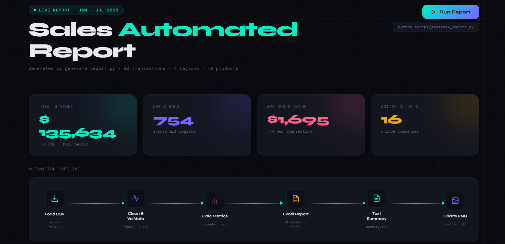

# Automated Reports

> Python automation demos that transform raw business data into structured, decision-ready reports.

---

## Demo 01 — Sales Report Automation

A portfolio-ready automation demo that transforms raw sales CSV data into executive-style reports, charts and structured business outputs — with a single command.

**[→ View Demo 01](demo_01_automated_reports/)**

---

## What this repository is

A collection of practical Python automation demos focused on real back-office and reporting workflows.

Each demo is self-contained with its own input data, script, outputs and documentation.

| Demo | Description | Status |
|------|-------------|--------|
| [Demo 01 — Sales Report](demo_01_automated_reports/) | CSV → Excel + charts + text summary | ✅ Complete |

---

## Tech stack

`Python` · `pandas` · `openpyxl` · `matplotlib`

---

*Portfolio project · Automated Reports*
